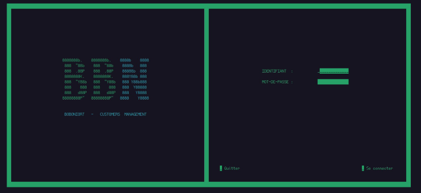
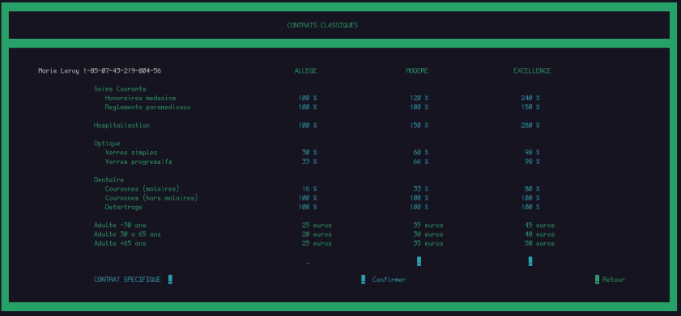
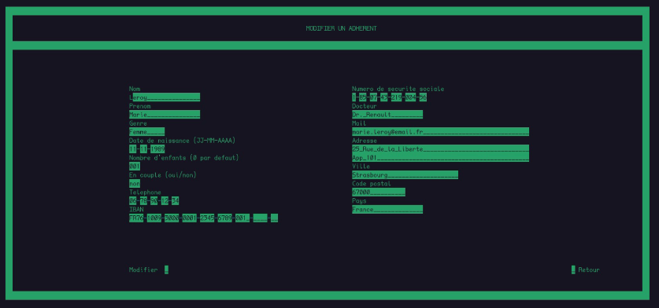
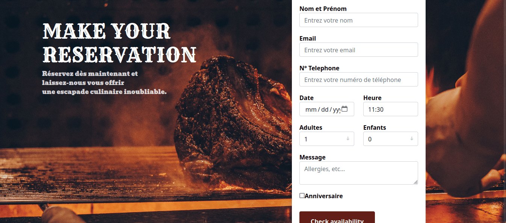
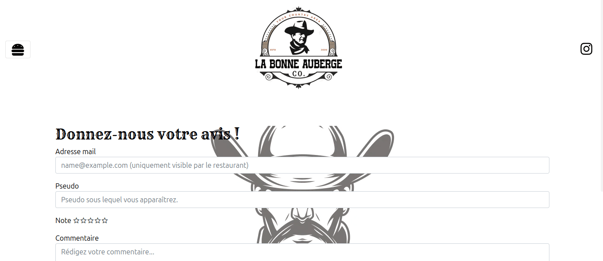

### __Programming Languages__

### __Frameworks and Libraries__

### __Technologies and Tools__

### __Operating Systems__

### __Mainframe Operating Systems__

### __Other Categories__

## 🚀 Latest Projects
 

### 💼&nbsp;  __Mutual insurance in Cobol :__

__Boboniort__ Project is an application ecosystem aimed at improving the efficiency of internal operations for a fictional mutual insurance company developed in COBOL.

#### Objective:

* Provide a user-friendly interface for managing member information, contributions, reimbursements, and services.
* Automate manual processes, including billing, report generation, and processing requests.
* Ensure quick access to relevant data with search and filtering features.
 
 

&nbsp;&nbsp;&nbsp;&nbsp;

 
 

  
Click to view more 

   

  
  

  

&nbsp;&nbsp;

### 👥  Contributors :

[AlexEnCode](https://github.com/AlexEnCode)

[Remi-Debu](https://github.com/Remi-Debu)

[Bafodej](https://github.com/bafodej)

[Isabellem27](https://github.com/isabellem27)

[SafaaKrim](https://github.com/SafaaKrim)

[YvesLevyJo](https://github.com/YvesLevyJo)

-------------------------------------------
 

### 🍖&nbsp;  __Restaurant website built with .NET MVC:__

The "__La Bonne Auberge__" project is an interactive website designed to provide an exceptional culinary experience for a fictional restaurant.

#### Objective:

* Provide a user-friendly interface for users to explore the menu, restaurant information, customer reviews, and much more.
* Allow users to browse the online menu and make reservations in just a few clicks.
* Offer a space for users to read comments and ratings from satisfied customers, facilitating the sharing of experiences.
 
 

&nbsp;&nbsp;&nbsp;&nbsp;

 

   
Click to view more 

   
  
  
  

  
  

 
&nbsp;&nbsp;

### 👥  Contributors :

[EnguerranSGG](https://github.com/EnguerranSGG)

[ACH90](https://github.com/ACH90)

-------------------------------------------